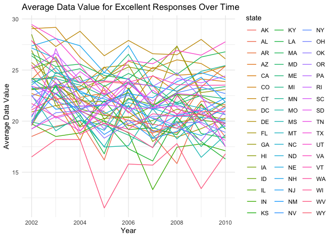
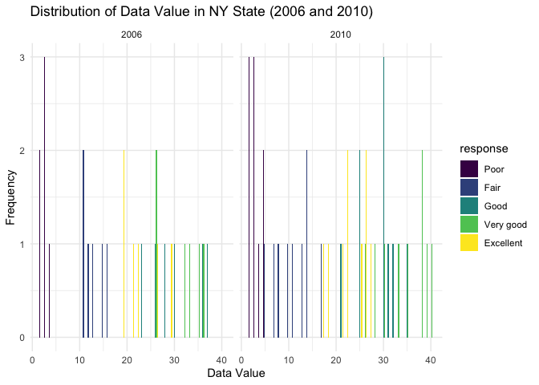
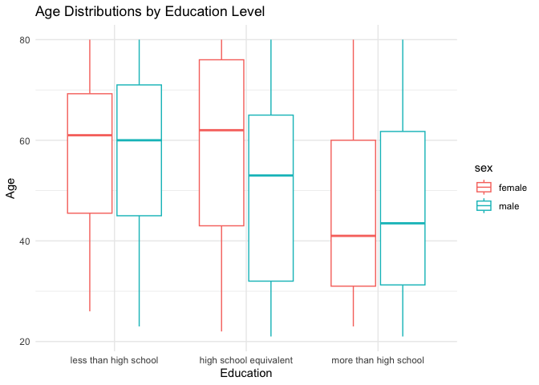
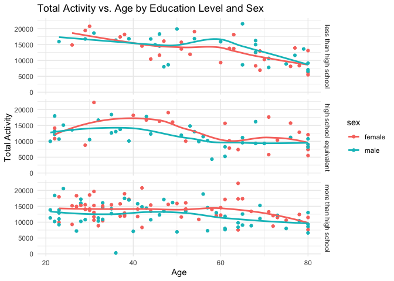
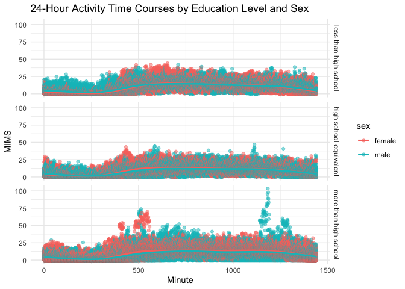

p8105_hw3_jr4392
================
Junyi Ren
2023-10-14

``` r
library(tidyverse)
```

    ## ── Attaching core tidyverse packages ──────────────────────── tidyverse 2.0.0 ──
    ## ✔ dplyr     1.1.3     ✔ readr     2.1.4
    ## ✔ forcats   1.0.0     ✔ stringr   1.5.0
    ## ✔ ggplot2   3.4.3     ✔ tibble    3.2.1
    ## ✔ lubridate 1.9.2     ✔ tidyr     1.3.0
    ## ✔ purrr     1.0.2     
    ## ── Conflicts ────────────────────────────────────────── tidyverse_conflicts() ──
    ## ✖ dplyr::filter() masks stats::filter()
    ## ✖ dplyr::lag()    masks stats::lag()
    ## ℹ Use the conflicted package (<http://conflicted.r-lib.org/>) to force all conflicts to become errors

## Problem 1

``` r
library(p8105.datasets)
data("instacart")
```

The data `instacart` has 1384617 observations and 15 variables. Some key
variables are `order_id`: order identifier, `product_id`: product
identifier, `add_to_cart_order`: order in which each product was added
to cart , `user_id`: customer identifier, `order_number`: the order
sequence number for this user (1=first, n=nth), `order_dow`: the day of
the week on which the order was placed, `order_hour_of_day`: the hour of
the day on which the order was placed, `product_name`: name of the
product, `aisle_id`: aisle identifier, `department_id`: department
identifier, `aisle`: the name of the aisle. Order_id 1 is made by
user_id 112108. The 4th order is made on the 4th day of the week at 10.
The product Bulgarian Yogurt with product_id 49302 is on aisle_id 120
which is yogurt from dairy eggs department.

``` r
instacart |> 
  count(aisle) |> 
  arrange(desc(n))
```

    ## # A tibble: 134 × 2
    ##    aisle                              n
    ##    <chr>                          <int>
    ##  1 fresh vegetables              150609
    ##  2 fresh fruits                  150473
    ##  3 packaged vegetables fruits     78493
    ##  4 yogurt                         55240
    ##  5 packaged cheese                41699
    ##  6 water seltzer sparkling water  36617
    ##  7 milk                           32644
    ##  8 chips pretzels                 31269
    ##  9 soy lactosefree                26240
    ## 10 bread                          23635
    ## # ℹ 124 more rows

``` r
instacart |> 
  count(aisle) |> 
  filter(n > 10000) |> 
  mutate(aisle = fct_reorder(aisle, n)) |> 
  ggplot(aes(x = aisle, y = n)) + 
  geom_point() + 
  labs(title = "Number of items ordered in each aisle") +
  theme(axis.text.x = element_text(angle = 60, hjust = 1))
```

<!-- -->

``` r
instacart |> 
  filter(aisle %in% c("baking ingredients", "dog food care", "packaged vegetables fruits")) |>
  group_by(aisle) |> 
  count(product_name) |> 
  mutate(rank = min_rank(desc(n))) |> 
  filter(rank < 4) |> 
  arrange(desc(n)) |>
  knitr::kable()
```

| aisle                      | product_name                                  |    n | rank |
|:---------------------------|:----------------------------------------------|-----:|-----:|
| packaged vegetables fruits | Organic Baby Spinach                          | 9784 |    1 |
| packaged vegetables fruits | Organic Raspberries                           | 5546 |    2 |
| packaged vegetables fruits | Organic Blueberries                           | 4966 |    3 |
| baking ingredients         | Light Brown Sugar                             |  499 |    1 |
| baking ingredients         | Pure Baking Soda                              |  387 |    2 |
| baking ingredients         | Cane Sugar                                    |  336 |    3 |
| dog food care              | Snack Sticks Chicken & Rice Recipe Dog Treats |   30 |    1 |
| dog food care              | Organix Chicken & Brown Rice Recipe           |   28 |    2 |
| dog food care              | Small Dog Biscuits                            |   26 |    3 |

``` r
instacart |>
  filter(product_name %in% c("Pink Lady Apples", "Coffee Ice Cream")) |>
  group_by(product_name, order_dow) |>
  summarize(mean_hour = mean(order_hour_of_day)) |>
  pivot_wider(
    names_from = order_dow, 
    values_from = mean_hour) |>
  knitr::kable(digits = 2)
```

    ## `summarise()` has grouped output by 'product_name'. You can override using the
    ## `.groups` argument.

| product_name     |     0 |     1 |     2 |     3 |     4 |     5 |     6 |
|:-----------------|------:|------:|------:|------:|------:|------:|------:|
| Coffee Ice Cream | 13.77 | 14.32 | 15.38 | 15.32 | 15.22 | 12.26 | 13.83 |
| Pink Lady Apples | 13.44 | 11.36 | 11.70 | 14.25 | 11.55 | 12.78 | 11.94 |

## Problem 2

``` r
library(p8105.datasets)
data("brfss_smart2010")
```

``` r
brfss = 
  brfss_smart2010|>
  janitor::clean_names() |>
  rename(state = locationabbr) |>
  filter(topic == "Overall Health") |>
  mutate(
    response = factor(response, levels = c("Poor","Fair","Good", "Very good","Excellent"), ordered = TRUE))
```

``` r
brfss_2002 = brfss |>
  filter(year == 2002) |>
  group_by(state, response) |>
  summarize(n_obs = n()) |>
  filter(n_obs >=7)
```

    ## `summarise()` has grouped output by 'state'. You can override using the
    ## `.groups` argument.

``` r
brfss_2010 = brfss |>
  filter(year == 2010) |>
  group_by(state, response) |>
  summarize(n_obs = n()) |>
  filter(n_obs >= 7)
```

    ## `summarise()` has grouped output by 'state'. You can override using the
    ## `.groups` argument.

In 2002, CT, FL, MA, NC, NJ, PA were observed at 7 or more locations. In
2010, CA, CO, FL, MA, MD, NC, NE, NJ, NY, OH, PA, SC, TX, WA were
observed at 7 or more locations.

``` r
brfss |>
  filter(response == "Excellent") |>
  group_by(year, state) |>
  summarise(ave_data_value = mean(data_value)) |>
  ggplot(aes(x = year, y = ave_data_value, group = state, color = state)) +
    geom_line() +
  labs(
    title = "Average Data Value for Excellent Responses Over Time",
    x = "Year",
    y = "Average Data Value")+
  theme_minimal()
```

    ## `summarise()` has grouped output by 'year'. You can override using the
    ## `.groups` argument.

    ## Warning: Removed 3 rows containing missing values (`geom_line()`).

<!-- -->
The graph shows the change in average data values by state from 2002 to
2010.

``` r
brfss |>
   filter(state == "NY" & (year == 2006 | year == 2010))  |>
  ggplot(aes(x = data_value, fill = response)) +
  geom_histogram(binwidth = 1, position = "dodge") +
  facet_wrap(~year, ncol = 2) +
  labs(title = "Distribution of Data Value in NY State (2006 and 2010)",
       x = "Data Value",
       y = "Frequency") +
  theme_minimal()
```

<!-- -->

The distribution of the data for 2006 and 2010 is roughly the same, with
the data means ranked in the order of very good, good, excellent, fair,
and poor. 2010 means ranked high in good, very good, and excellent.

## Problem 3

``` r
nhanes_accel = 
  read_csv("./nhanes_accel.csv") |>
  janitor::clean_names() |>
  pivot_longer(
    min1:min1440,
    names_to = "minute",
    values_to = "MIMS_Value"
    )
```

    ## Rows: 250 Columns: 1441
    ## ── Column specification ────────────────────────────────────────────────────────
    ## Delimiter: ","
    ## dbl (1441): SEQN, min1, min2, min3, min4, min5, min6, min7, min8, min9, min1...
    ## 
    ## ℹ Use `spec()` to retrieve the full column specification for this data.
    ## ℹ Specify the column types or set `show_col_types = FALSE` to quiet this message.

``` r
nhanes_covar = 
  read_csv("./nhanes_covar.csv", skip = 4) |>
  janitor::clean_names() |>
  filter(age >= 21) |>
  drop_na() |>
  mutate(
    education = 
      case_match(
        education, 
        1 ~ "less than high school", 
        2 ~ "high school equivalent",
        3 ~ "more than high school"),
    education = factor(education, levels = c("less than high school", "high school equivalent", "more than high school")
)
  ) |>
  mutate(
    sex = 
      case_match(
        sex, 
        1 ~ "male", 
        2 ~ "female"),
    sex = as.factor(sex) 
  ) 
```

    ## Rows: 250 Columns: 5
    ## ── Column specification ────────────────────────────────────────────────────────
    ## Delimiter: ","
    ## dbl (5): SEQN, sex, age, BMI, education
    ## 
    ## ℹ Use `spec()` to retrieve the full column specification for this data.
    ## ℹ Specify the column types or set `show_col_types = FALSE` to quiet this message.

``` r
merge_nhanes = 
  nhanes_covar |>
  inner_join(nhanes_accel, by = "seqn")
```

``` r
nhanes_covar |>
  group_by(education, sex) |>
  summarise(count = n()) |>
  spread(key = sex, value = count)
```

    ## `summarise()` has grouped output by 'education'. You can override using the
    ## `.groups` argument.

    ## # A tibble: 3 × 3
    ## # Groups:   education [3]
    ##   education              female  male
    ##   <fct>                   <int> <int>
    ## 1 less than high school      28    27
    ## 2 high school equivalent     23    35
    ## 3 more than high school      59    56

The difference in the number of men and women between those below high
school and those above high school is small. There is one more female
below high school and three more females above high school. There are 12
more males than females in the high school equivalent.

``` r
merge_nhanes |>
  ggplot(aes(x = education, y = age, color = sex)) +
  geom_boxplot() +
  labs(title = "Age Distributions by Education Level",
       x = "Education",
       y = "Age") +
  theme_minimal()
```

<!-- -->

At levels less than high school, the age distribution of men and women
is roughly the same. At the high school equivalent level, females are
older than males. At the more than high school level, males are slightly
older than females.

``` r
merge_nhanes |>
  group_by(seqn, education, sex, age) |>
  summarise(total_activity = sum(MIMS_Value)) |>
  ggplot(aes(x = age, y = total_activity, color = sex)) +
  geom_point() +
  geom_smooth(se = FALSE) +
  facet_grid(education ~ .) +
  labs(title = "Total Activity vs. Age by Education Level and Sex",
       x = "Age",
       y = "Total Activity") +
  theme_minimal()
```

    ## `summarise()` has grouped output by 'seqn', 'education', 'sex'. You can
    ## override using the `.groups` argument.
    ## `geom_smooth()` using method = 'loess' and formula = 'y ~ x'

<!-- -->

At all levels of education, total activity decreases with age for both
sexes. At levels of education less than high school, total activity is
higher for females before age 40 and for males after age 40. At the high
school equivalent level, total activity is higher for females. Total
activity is higher for females at the higher than high school level of
education.

``` r
merge_nhanes |>
  mutate(minute = str_remove_all(minute, "min"),
         minute = as.numeric(minute)) |>
  arrange(minute) |>
  ggplot(aes(x = minute, y = MIMS_Value, color = sex)) +
  geom_point(alpha = 0.5) +
  geom_smooth(se = FALSE) +
  facet_grid(education ~ .) +
  labs(title = "24-Hour Activity Time Courses by Education Level and Sex",
       x = "Minute",
       y = "MIMS") +
  theme_minimal()
```

    ## `geom_smooth()` using method = 'gam' and formula = 'y ~ s(x, bs = "cs")'

<!-- -->

As can be seen from the plot, the trend in 24-hour activity is roughly
the same for females and males at all three levels of education.
